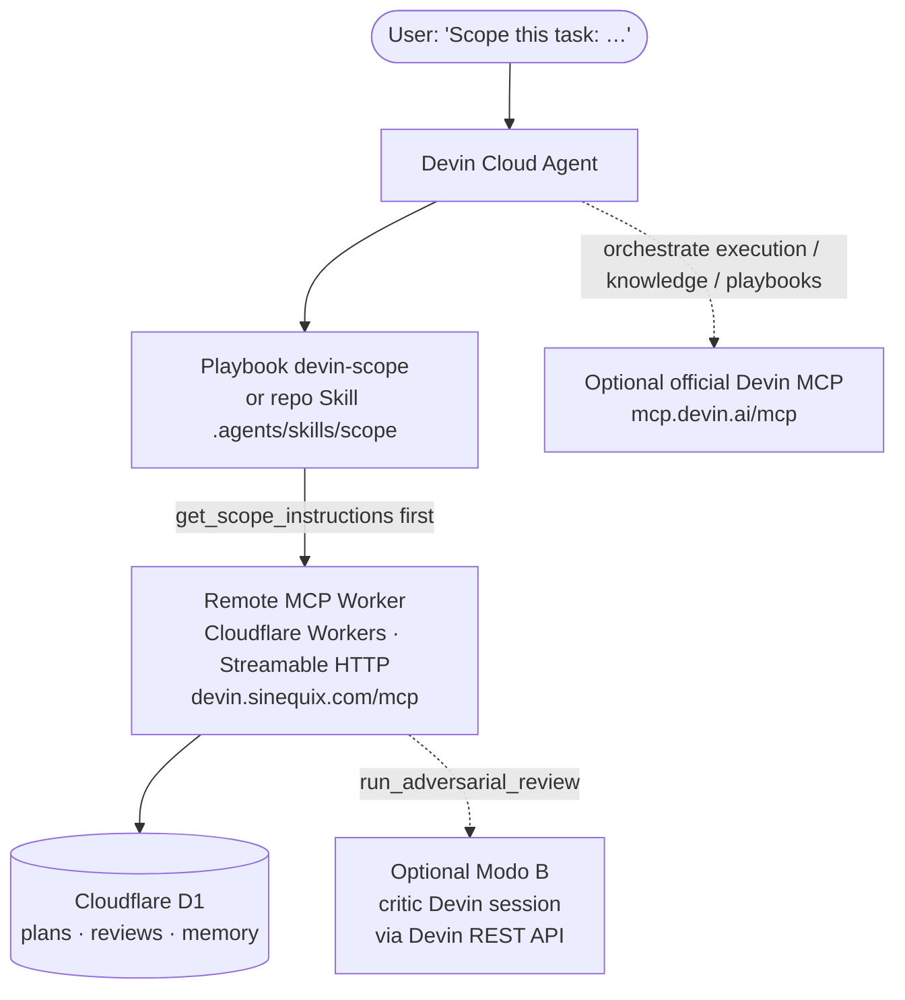
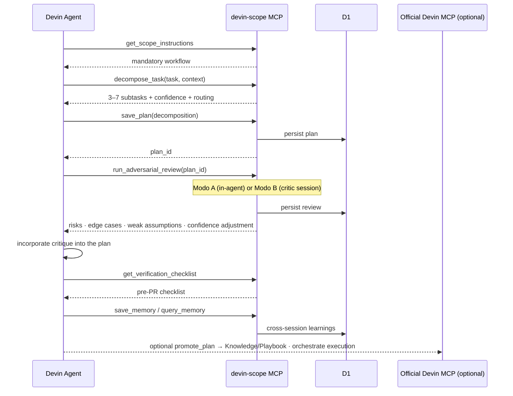
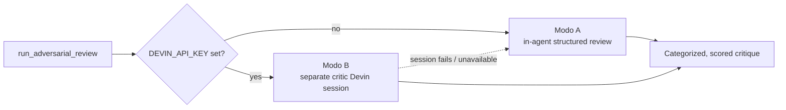

# devin-scope

> Turn ambiguous engineering tasks into high-confidence, **adversarially reviewed** execution plans —
> entirely inside Devin Cloud agents.

**The problem:** agents dive into coding on underspecified prompts. Vague tasks become missed edge
cases, unstated assumptions, and rework. `devin-scope` forces a rigorous, memory-backed planning phase
*before* a single line of code is written.

It is an open-source planning harness for [Devin](https://devin.ai): structured **task decomposition**,
a mandatory **adversarial review**, persistent **cross-session memory**, and **self-verification**
checklists — delivered as a remote MCP server (Cloudflare Workers + D1) plus a minimal Playbook and a
native Skill. After a one-time setup, any Cloud agent runs the whole pipeline from a prompt as simple as
`Scope this task: …`.

- **Production endpoint:** `https://devin.sinequix.com/mcp` (health check at `/health` → `ok`)
- **Runtime:** Cloudflare Workers + D1 (SQLite)
- **Transport:** Streamable HTTP (primary) · optional local stdio for Desktop/CLI
- Full spec: [`docs/PRD.md`](docs/PRD.md) · Design: [`docs/architecture.md`](docs/architecture.md)

## Architecture



`devin-scope` owns **planning + adversarial rigor**; the optional official Devin MCP owns **execution
orchestration** (managed sessions, Knowledge, Playbooks). The two compose into a hybrid where plans are
scoped, reviewed, and persisted before any managed session starts work.

## The pipeline

The Playbook/Skill forces the agent through this exact sequence:



### Modo A vs. Modo B



The review response reports which path ran via a `mode` field (`in-agent` or `critic-session`), and the
`criticSessionUrl` for Modo B. Modo B **always falls back to Modo A** on any failure, so the pipeline
never breaks.

## Features

- **Mandatory adversarial review** — every plan gets a ruthless critic before a single line of code is written.
- **Model-backed decomposition** — a Workers AI model breaks the task into 3–7 ordered subtasks, each with calibrated confidence and a justification.
- **Deterministic heuristic fallback** — no model binding, or a bad model response? A strong rule-based decomposition keeps `decompose_task` reliable.
- **Categorized, scored risks** — each risk is `likelihood × impact` (1–9) with a severity, an explanation, and the subtasks it touches — not a vague warning.
- **Edge cases & weak assumptions** — the review surfaces the failure modes and unstated assumptions your prompt quietly relied on.
- **Persistent cross-session memory** — plans, reviews, and learnings live in D1, so a later session inherits what an earlier one figured out.
- **Workspace isolation** — every plan, review, and memory row is scoped to a `workspace`; reads never leak across tenants.
- **Optional Bearer-token auth** — public by default for zero-friction demos; set one secret to lock `POST /mcp` down.
- **Optional critic Devin session (Modo B)** — delegate the review to a short, separate critic Devin via the Devin API, with graceful fallback to in-agent review.
- **Official Devin MCP integration** — hand the reviewed plan to `devin_session_create` / `devin_session_gather` / `devin_knowledge_manage` for real execution orchestration.
- **Auto-promotion** — `promote_plan` scores a high-quality plan and emits a ready-to-persist Knowledge note or Playbook for reuse.
- **Cost/confidence routing** — per-subtask suggestions for model tier, local vs. cloud, and how many managed Devins to run in parallel.
- **Ticket-driven scoping** — point `scope_ticket` at a Linear/Jira id or URL and get a plan; post it back to the ticket with `post_plan_to_ticket`.
- **Self-verification checklists** — a concrete pre-PR gate (tests, lint/typecheck, edge cases, no unrelated changes) the agent must satisfy.
- **Structured logging & latency budgets** — single-line JSON logs with secret redaction, tracked against an 800 ms per-tool budget.
- **Optional local stdio transport** — the exact same tools over stdin/stdout for Devin Desktop / CLI, backed by a local file store when D1 is out of reach.

## MCP tools

The server exposes **11 tools** (authoritative schemas live in [`mcp/src/tools.ts`](mcp/src/tools.ts)):

| Tool | Purpose |
| --- | --- |
| `get_scope_instructions` | Serve the full planning workflow the agent must follow. |
| `decompose_task` | Break an ambiguous task into 3–7 subtasks with per-subtask confidence, an execution strategy, and cost/confidence routing. |
| `run_adversarial_review` | Structured, categorized critique: weak assumptions, missing edge cases, scored risks (likelihood×impact), recommended changes, confidence adjustment. Persisted to D1. |
| `save_plan` | Persist a decomposition and return a `plan_id`. |
| `get_plan` | Retrieve a saved plan by `plan_id`, scoped to its workspace. |
| `save_memory` | Store a key/value learning (with tags), scoped by workspace. |
| `query_memory` | Substring-search stored memory, scoped by workspace. |
| `get_verification_checklist` | Return the self-verification checklist to satisfy before proposing a PR. |
| `promote_plan` | Score a plan against quality heuristics and, if it qualifies, emit a Knowledge/Playbook artifact plus the Devin MCP calls to persist it. |
| `scope_ticket` | Ingest a Linear/Jira ticket (id or URL) and decompose it into a plan. |
| `post_plan_to_ticket` | Post a saved plan back to its Linear/Jira ticket as a comment. |

## Quick start

You do not need to run anything locally to *use* devin-scope — point Devin at the hosted server.

1. **Add the MCP in Devin.** Settings → Connections → MCP servers → Add a custom MCP → **HTTP /
   Streamable HTTP** → `https://devin.sinequix.com/mcp`.
2. **Attach the Playbook** `devin-scope` when starting a session — or connect this repo so the Skill
   (`.agents/skills/scope`) is auto-discovered.
3. **Use it:** `Scope this task: <your ambiguous task>`.

Check the deployment is healthy at any time:

```bash
curl https://devin.sinequix.com/health      # -> ok
```

See [`examples/demo-script.md`](examples/demo-script.md),
[`examples/ambiguous-tasks.md`](examples/ambiguous-tasks.md), and
[`examples/managed-orchestration.md`](examples/managed-orchestration.md) (the hybrid flow with the
official Devin MCP).

## Self-hosting

Deploy your own Worker + D1 (needed only if you want to run or modify the server):

```bash
cd mcp
npm install
wrangler d1 create devin_scope          # paste the returned database_id into wrangler.toml
npm run db:init                          # applies schema.sql to the remote D1 database
npm run deploy                           # deploys to Cloudflare Workers
```

Then add your own `/mcp` URL in Devin as above. `decompose_task` uses the Workers AI (`AI`) binding when
present and falls back to the heuristic otherwise; override the model with the `DECOMPOSE_MODEL` var.

## Local development

```bash
cd mcp
npm install
npm run typecheck
npm test                                 # unit tests (node:test via tsx)
npm run test:integration                 # workers-runtime integration tests (vitest)

# Apply the schema to the local D1 store once, then run the Worker:
npx wrangler d1 execute devin_scope --local --file=./schema.sql
npm run dev                              # local Worker on http://localhost:8787 (POST /mcp)
```

Only `POST /mcp` (JSON-RPC 2.0) and `GET /health` are served. Quick smoke test:

```bash
curl -s http://localhost:8787/mcp -H 'content-type: application/json' \
  -d '{"jsonrpc":"2.0","id":1,"method":"tools/list"}'
```

## Configuration

All secrets are set as encrypted Worker secrets (`wrangler secret put …`) — never commit values. For
local dev, put them in a git-ignored `mcp/.dev.vars` file.

| Variable | Required? | Purpose |
| --- | --- | --- |
| `AUTH_TOKEN` | Optional | When set, every `POST /mcp` must send `Authorization: Bearer <AUTH_TOKEN>`; otherwise the server is public. `GET /health` is always public. |
| `DEVIN_API_KEY` | Optional | Enables **Modo B**: delegates `run_adversarial_review` to a separate critic Devin session (falls back to Modo A when unavailable). |
| `DEVIN_API_BASE_URL` | Optional | Override the Devin API base URL (defaults to `https://api.devin.ai/v1`). |
| `DECOMPOSE_MODEL` | Optional | Override the Workers AI model used by `decompose_task` (defaults to `@cf/meta/llama-3-8b-instruct`). |
| `LINEAR_API_KEY` | For Linear tickets | Auth for `scope_ticket` / `post_plan_to_ticket` against Linear. |
| `JIRA_BASE_URL` / `JIRA_EMAIL` / `JIRA_API_TOKEN` | For Jira tickets | Auth for `scope_ticket` / `post_plan_to_ticket` against Jira. |

### Authentication (optional)

The MCP is **public by default** (per PRD §6.1/§13) so the demo works with no setup. To require a shared
Bearer token for a non-demo deployment:

```bash
cd mcp
wrangler secret put AUTH_TOKEN     # paste your token when prompted
```

When `AUTH_TOKEN` is set, requests missing the header or sending the wrong token get `401 Unauthorized`;
add the header under the custom MCP server's configuration in Devin. When unset, behavior is the public
demo.

### Adversarial critic session (Modo B, optional)

By default `run_adversarial_review` performs the review in-agent (Modo A). With `DEVIN_API_KEY` set, the
review is delegated to a short, separate critic Devin session via the Devin REST API, gracefully falling
back to Modo A when the session is unavailable or fails:

```bash
cd mcp
wrangler secret put DEVIN_API_KEY
```

### Linear / Jira integration

`scope_ticket` and `post_plan_to_ticket` read ticket content from Linear or Jira and can write the final
plan back as a comment. The provider is inferred from a ticket URL, or pass `provider: "linear" | "jira"`
with a bare id. Configure the credentials above as Worker secrets.

## Promoting high-quality plans

Once a plan has been decomposed, adversarially reviewed, and incorporated, call `promote_plan` to score
it against quality heuristics. When it qualifies, the tool emits a **Devin Knowledge** note or a new
**Playbook** artifact plus the official Devin MCP calls to persist it. See
[`docs/promotion.md`](docs/promotion.md) for the heuristics and the full flow.

## Local stdio transport (Devin Desktop / CLI — optional)

The primary, Cloud-first path is the remote Streamable HTTP Worker above. As a convenience for Devin
**Desktop / CLI** power users, `devin-scope` also ships an optional local stdio build
(`mcp/src/stdio.ts`) exposing the *exact same tools* over newline-delimited JSON-RPC 2.0 on
stdin/stdout:

```bash
cd mcp
npm install                # installs tsx (used to run the TypeScript entrypoint)

# Register the local server with the Devin CLI (adjust the absolute path):
devin mcp add devin-scope-local -- npm --prefix /ABSOLUTE/PATH/TO/devin-advisor/mcp run stdio
# Equivalent direct form:
# devin mcp add devin-scope-local -- npx -y tsx /ABSOLUTE/PATH/TO/devin-advisor/mcp/src/stdio.ts
```

Then use it exactly like the remote server (e.g. `Scope this task: <your task>`).

**Persistence — D1 is remote.** Cloudflare D1 backs the HTTP Worker and is *not* reachable from a local
process, so the stdio build falls back to a **local file-backed store** (`mcp/src/local-store.ts`):

- Default location: `~/.devin-scope/local-store.json`.
- Override with `DEVIN_SCOPE_LOCAL_DB=/path/to/store.json`.
- Use `DEVIN_SCOPE_LOCAL_DB=:memory:` for an ephemeral, non-persisted store.

This local store is **per-machine and not shared** across sessions or users. For shared cross-session
memory, use the remote Streamable HTTP deployment.

## Documentation

- [`docs/PRD.md`](docs/PRD.md) — full product spec.
- [`docs/architecture.md`](docs/architecture.md) — design and key decisions.
- [`docs/troubleshooting.md`](docs/troubleshooting.md) — troubleshooting & FAQ.
- [`docs/marketplace.md`](docs/marketplace.md) — Devin MCP Marketplace submission prep.
- [`examples/`](examples) — demo script, example ambiguous tasks, and the managed-orchestration flow.

## Troubleshooting

Common fixes (full list in [`docs/troubleshooting.md`](docs/troubleshooting.md)):

- **Tools not listed in Devin?** Ensure the URL ends in `/mcp` and the transport is HTTP / Streamable
  HTTP; check `GET /health` returns `ok`.
- **`no such table` errors?** Apply the schema with `npm run db:init` (or `--local` for local dev).
- **`wrangler deploy` D1 error?** Create the database and paste its `database_id` into `wrangler.toml`.
- **Memory empty in a second session?** Use a consistent `workspace` id (or omit it in both places).

## Roadmap

Work is tracked as GitHub issues in two phases:

- **Foundational** (`phase:foundational`) — scaffolding, core MCP tools, D1 persistence, Skill/Playbook,
  CI, and base docs.
- **Improvements** (`phase:improvements`) — model-backed generation, richer adversarial review, auth,
  Devin API orchestration (Modo B), ticket integration, additional tests, and polish.

A Devin MCP Marketplace listing is a post-MVP goal; submission metadata and a readiness checklist are
prepared in [`docs/marketplace.md`](docs/marketplace.md).

## License

[MIT](LICENSE)
